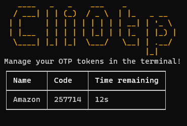

# CliOtp
A tool to manage OTP codes in the terminal. Built with C# with .NET.

## Features

- Configure application with **.json** file
- Display all codes, with name and duration

## Future work

- More configuration options
- Add entries by the CLI